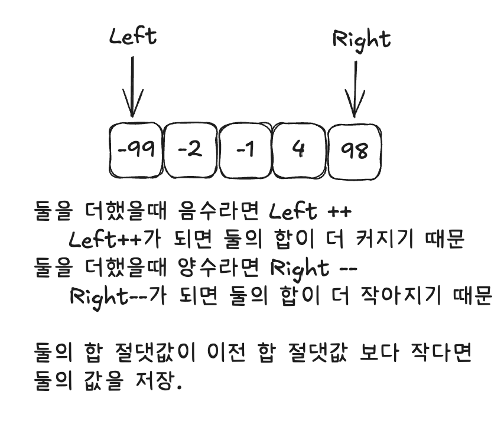

### 문제 이해
1. 랜덤 숫자 100,000개가 주어진다.
2. 더해서 0에 가장 가까운 두수를 찾아라

### 문제 해결법 도출
1. 0에 가장 가까운 수를 찾기 위해서, 즉 숫자 크기를 중요시 하는 문제이고, 배열의 기본 인덱스가 중요한 문제가 아니기 때문에 읽자마자 sort해야겠다고 판단.
2. 100,000의 수가 주어지기 때문에 O(n^2)으로는 풀 수 없다. 2개 이상의 수를 비교해야하는데 O(n^2)이 안되기 때문에 2분탐색 or 투포인터라고 판단.
3. 2분탐색일 가능성이 먼저 떠올라서 여러가지 생각을 해보았지만 실패
4. 투포인터로 양끝부터 비교 시작.

걸린 시간: 22분