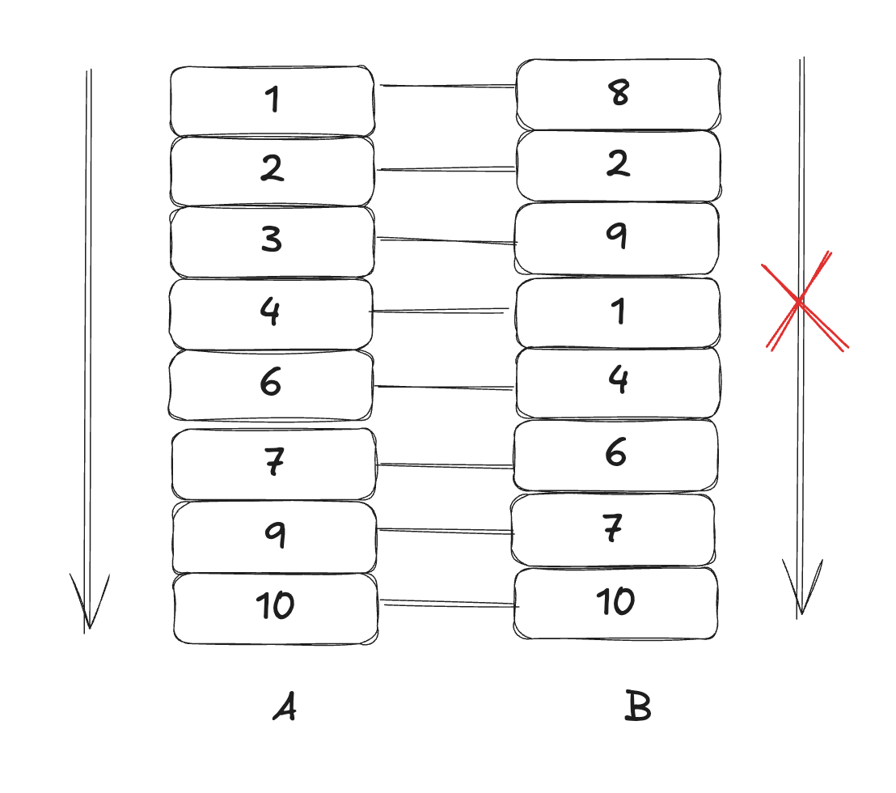

## 문제 이해
1. 문제 배경에서 기둥이 A와 B가 존재하고, 전깃줄이 얽혀있다.
2. 가장 적은 수의 줄을 끊어서 얽히지 않게 하여라

## 문제 해결법 도출
1. 어떤 전깃줄을 잘라야하는지 고민하였다
2. 문제의 예시 이미지에는 A기둥과 B기둥 모두 정렬되어 있었고, 전깃줄이 얽혀있었다.
3. 문제 예제에서는 A와 B모두 정렬되어있지 않았다.
4. 일단 A를 기준으로하던 B를 기준으로 하던 정렬을해야겠다고 생각하고, A를 기준으로 정렬하였다.
5. A를 기준으로 정렬하니 당연하게 B는 뒤죽 박죽이었다.

6. 줄을 끊는 기준이 무엇일지 고민해보니, A가 오름차순일시 B에서 오름차순이 아닌 인덱스가 꼬인 줄이라는걸 도출했다.
7. 결과적으로 A와 B모두 오름차순 혹은 내림차순으로 정렬되어 있어야 한다는 결론에 도달.
8. A는 이미 정렬되었고, B를 정렬하는 방법을 가장 긴 증가하는 or 감소하는 부분수열을 찾아주면 됬다.

